# Advent Hymnals

A comprehensive digital platform for preserving and exploring 160+ years of Adventist hymnody heritage (1838-2025).

## 🎵 Project Overview

**Advent Hymnals** is the world's most comprehensive digital collection of Seventh-day Adventist hymnals, featuring 13 complete hymnal collections spanning from the earliest Adventist hymns to contemporary worship music. Our platform preserves the rich musical heritage of the Adventist movement while making it accessible to modern congregations, researchers, and music enthusiasts worldwide.

### Featured Hymnal Collections

#### Historical Adventist Hymnals (1838-1886)
- **[Hymns for the Poor of the Flock (1838)](https://adventhymnals.org/hymns-for-the-poor-of-the-flock)** - 453 hymns - The earliest Adventist collection
- **[Millenial Harp (1843)](https://adventhymnals.org/millenial-harp)** - 267 hymns - Joshua V. Hymes compilation  
- **[Hymns for God's Peculiar People (1849)](https://adventhymnals.org/hymns-for-gods-peculiar-people)** - 53 hymns - James White compilation
- **[Hymns for Second Advent Believers (1852)](https://adventhymnals.org/hymns-for-second-advent-believers)** - 177 hymns - James White compilation
- **[Hymns and Tunes Series (1869-1886)](https://adventhymnals.org/hymns-and-tunes)** - 526+ hymns each - Evolution of Adventist worship music

#### Modern Adventist Hymnals (1908-2000)
- **[Christ in Song (1908)](https://adventhymnals.org/christ-in-song)** - 949 hymns - F.E. Belden's comprehensive collection
- **[Church Hymnal (1941)](https://adventhymnals.org/church-hymnal)** - 703 hymns - General Conference official hymnal
- **[Seventh-day Adventist Hymnal (1985)](https://adventhymnals.org/seventh-day-adventist-hymnal)** - 695 hymns - Current official SDA hymnal
- **[Campus Melodies (2000)](https://adventhymnals.org/campus-melodies)** - 219 hymns - Contemporary youth collection

#### International Collections
- **[Nyimbo za Kristo (1944)](https://adventhymnals.org/nyimbo-za-kristo)** - 220 hymns - Kiswahili hymnal
- **[Wende Nyasaye (1936)](https://adventhymnals.org/wende-nyasaye)** - 332 hymns - Dholuo (Luo) hymnal

## 🌟 Key Features

### For Worship Leaders & Congregations
- **Instant Hymn Lookup** - Search by number, title, or first line across all hymnals
- **Multi-format Display** - Lyrics, sheet music, and audio when available
- **Cross-Hymnal References** - Find the same hymn across different collections
- **Mobile-Optimized** - Perfect for worship projection and mobile devices

### For Researchers & Scholars
- **Historical Timeline** - Trace the evolution of Adventist hymnody from 1838-2000
- **Comparative Analysis** - Study how hymns changed across different editions
- **Metadata Mining** - Search by composer, poet, meter, topic, or scripture reference
- **Citation Tools** - Proper academic citations for research purposes

### For Musicians
- **Sheet Music Access** - High-quality scanned hymnal pages
- **Audio Playback** - MIDI and MP3 recordings where available
- **Metrical Index** - Find hymns by meter for tune substitution
- **Composer Catalog** - Complete works by composer across all collections

### For Global Community
- **Multilingual Support** - English, Kiswahili, and Dholuo interfaces
- **Cultural Context** - Historical notes on hymn origins and significance
- **Accessibility Features** - Screen reader compatible and keyboard navigation

## 🏗️ Technical Architecture

### Current Implementation
```
advent-hymnals-mono-repo/
├── apps/
│   ├── web/              # Next.js web application
│   ├── media-server/     # Static media file server
│   └── mobile/           # React Native mobile app (roadmap)
├── packages/
│   ├── shared/           # Common types and utilities
│   ├── hymnal-processor/ # Core processing logic
│   ├── seo-optimizer/    # SEO and structured data
│   └── audio-player/     # Media playback components
├── data/
│   ├── processed/        # Processed hymnal data (JSON)
│   └── sources/          # Raw source materials
│       ├── audio/        # MIDI and MP3 files
│       └── images/       # Hymnal page scans
├── scripts/
│   ├── setup-production-server.sh  # Automated server setup
│   └── deploy-new-production.sh    # One-command deployment
└── .github/workflows/    # Automated CI/CD pipelines
```

### Technology Stack
- **Frontend**: Next.js 14+ with TypeScript
- **Media Server**: nginx with optimized file serving
- **Styling**: Tailwind CSS for responsive design
- **Data**: Static JSON with dynamic search indexing
- **SEO**: Next.js SEO optimization with structured data
- **Deployment**: Docker containers with automated CI/CD
- **Analytics**: Privacy-focused usage tracking

### Production Infrastructure
- **Web Application**: Docker container with Next.js
- **Media Server**: High-performance nginx serving audio/images
- **SSL**: Let's Encrypt with automatic renewal
- **CDN**: Cloudflare for global content delivery
- **Monitoring**: Health checks and automated recovery

## 🚀 Development & Deployment

### Automated CI/CD Pipeline

Our platform features a fully automated deployment system that ensures seamless updates:

#### 🔄 Automatic Media File Deployment
When you update files in the `data/sources/` directory:
```bash
# Add new audio files
git add data/sources/audio/SDAH/201.mid
git commit -m "Add hymn 201 MIDI file"
git push
# → Automatically synced to https://media.yourdomain.com/audio/SDAH/201.mid
```

**Smart Detection System:**
- **Media-only changes**: Syncs audio/images, restarts media server
- **Code-only changes**: Deploys web app, includes media sync for consistency  
- **Combined changes**: Optimized deployment of both web app and media files

#### 🚀 One-Command Production Setup
Deploy a complete production server with a single command:
```bash
# From your development machine
./scripts/deploy-new-production.sh
```

This automatically:
- ✅ Provisions Ubuntu server with Docker
- ✅ Configures SSL certificates with Let's Encrypt
- ✅ Sets up nginx with media server optimization
- ✅ Uploads all hymnal data (audio, images, metadata)
- ✅ Configures GitHub Actions for continuous deployment

#### 📁 Data Transfer Method
- **Direct file transfer**: Uses `rsync` for efficient data sync
- **No git on server**: Production server never runs git commands
- **SSH key authentication**: No passphrases required
- **Incremental updates**: Only changed files are transferred
- **Target directory**: `/opt/advent-hymnals/data/sources/`

#### 🎯 Production Infrastructure
```
Production Server (/opt/advent-hymnals/)
├── docker-compose.yml     # Container orchestration
├── nginx/                 # Web server configuration
│   ├── conf.d/           # Auto-generated domain configs
│   ├── domains.txt       # SSL certificate domains
│   └── entrypoint.sh     # Automated SSL setup
├── data/sources/         # Media files (auto-synced)
│   ├── audio/           # MIDI/MP3 files
│   └── images/          # Hymnal page scans
└── .env                 # Production environment variables
```

### Roadmap

#### Phase 1: Web Application (Current)
- [x] Core hymnal data processing
- [x] SEO-optimized site structure
- [x] **Automated production deployment**
- [x] **Media server with audio/image serving**
- [x] **CI/CD pipeline with smart change detection**
- [ ] **In Development**: Enhanced responsive web interface
- [ ] Advanced search and filtering
- [ ] Interactive audio player with A-B looping

#### Phase 2: Enhanced Features (Q2 2025)
- [ ] **Desktop Application** - Offline access with Electron
- [ ] **Mobile Application** - Native iOS/Android apps
- [ ] User accounts and personal hymnals
- [ ] Social sharing and collaboration tools
- [ ] Advanced scholarly research tools

#### Phase 3: Community Features (Q3 2025)
- [ ] User-contributed content (corrections, translations)
- [ ] Community hymnal creation tools
- [ ] Integration with worship planning software
- [ ] API for third-party developers

## 🔍 SEO & Discoverability

Our platform is optimized for maximum discoverability across search engines:

### Targeted Search Terms
- "Seventh-day Adventist Hymnal" + hymn numbers/titles
- "SDA Hymnal" + specific hymn searches
- "Adventist hymns" + composer/topic searches
- "Nyimbo za Kristo" + Kiswahili hymn searches
- "Christ in Song hymnal" + historical searches
- "Church Hymnal 1941" + vintage hymn searches

### Structured Data Implementation
- **Rich Snippets** - Google displays hymnal sections and featured hymns
- **Breadcrumb Navigation** - Clear site hierarchy for search engines
- **Schema.org Markup** - MusicComposition and MusicAlbum schemas
- **Open Graph Tags** - Optimized social media sharing

### Site Structure for Search Visibility
```
adventhymnals.org/
├── seventh-day-adventist-hymnal/     # SDAH collection
│   ├── hymn-1-praise-to-the-lord/    # Individual hymn pages
│   └── search/                       # Collection-specific search
├── nyimbo-za-kristo/                 # Kiswahili collection
├── christ-in-song/                   # Historical collection
└── compare/                          # Cross-hymnal comparison
```

## 📱 Mobile Application & Update System

### Mobile App Features
Our Flutter mobile application provides full offline access to hymnal collections with automatic content updates:

#### 🚀 Seamless Update Mechanism
The mobile app features an innovative hybrid data architecture that eliminates app store delays for content updates:

**Layered Data Architecture:**
```
📱 Mobile App Data Layers
├── 🔒 BUNDLED (Essential content, shipped with app)
│   ├── Essential collections metadata (SDAH, CS1900)
│   ├── Top 100 most-used hymns for offline access
│   └── Core app configuration and fallback data
│
├── 💾 CACHED (Downloaded content, updatable)
│   ├── Full hymnal collections with complete lyrics
│   ├── Incremental updates and corrections
│   ├── User favorites and recently viewed hymns
│   └── Audio files and enhanced content
│
└── 🔄 RUNTIME (Unified access layer)
    └── Smart data merging with automatic fallbacks
```

#### 🔄 Automatic Update Detection
**Version-Based Updates:**
- Daily automatic checks for new content versions
- Server API endpoints: `/api/updates/version` and `/api/updates/updates/{from_version}`
- Version format: `YYYY.MM.DD` (e.g., "2024.07.10")
- Only downloads changed files for bandwidth efficiency

**Update Process Flow:**


**Update Advantages:**
- ✅ **No App Store Delays** - Content updates bypass app review process
- ✅ **Bandwidth Efficient** - Only changed files are downloaded
- ✅ **Offline Resilient** - Falls back to bundled data if updates fail
- ✅ **Version Controlled** - Full audit trail of all changes
- ✅ **Immediate Updates** - New content appears without app restart

#### 📲 Platform Support
- **Android APK** - Direct installation and Google Play Store
- **Linux Desktop** - Native GTK application for desktop users
- **Windows Desktop** - Native Windows application 
- **iOS** - Planned for App Store release (Q2 2025)

#### 🔧 Development & Building
```bash
# Build Android APK
flutter build apk --release

# Build Linux desktop application  
flutter build linux --release

# Build Windows desktop application
flutter build windows --release

# Run in development mode
flutter run --debug

# Run desktop version for development
flutter run -d linux --debug
```

#### ⛪ Church Mode & Worship Features
**Intelligent Church Mode Detection:**
- Automatic prompting during likely worship times (weekends, mornings)
- Diplomatic user-friendly messaging for worship focus
- Connectivity-aware to avoid disruptions during church services
- Reduces notifications and distractions for worship environments
- Configurable in app settings with manual enable/disable options

**Church Mode Benefits:**
- 🔕 Minimized notifications and background activity
- ⛪ Optimized interface for worship projection and reading
- 📱 Reduced data usage during church services
- 🎵 Prioritized hymnal content over auxiliary features
- 🕊️ Distraction-free worship experience

### Content Update Management

#### For Content Managers
When you update hymnal data in the `data/processed/` directory:

1. **Update Version Metadata:**
```bash
# Update data/processed/metadata/collections-metadata.json
{
  "version": "2024.07.15",
  "last_updated": "2024-07-15T00:00:00Z",
  "changelog": [
    {
      "version": "2024.07.15", 
      "changes": ["Added 5 new hymns to SDAH collection", "Fixed lyrics in CS1900 #123"]
    }
  ]
}
```

2. **Automatic Distribution:**
   - Web API immediately serves new version to mobile clients
   - Mobile apps detect updates during daily checks
   - Users receive non-intrusive update notifications
   - Content downloads automatically on WiFi

#### API Endpoints
The web application provides RESTful endpoints for the mobile update system:

- `GET /api/updates/version` - Current data version and available collections
- `GET /api/updates/updates/{from_version}` - Incremental updates since client version
- `GET /api/hymnals/{id}` - Full collection metadata and hymn listings
- `GET /api/hymns/{hymn_id}` - Individual hymn content and metadata

#### 📦 Enhanced Update System Features
**Collection-Level Change Detection:**
- **Added Collections** - New hymnal collections are automatically distributed
- **Deleted Collections** - Removed collections are cleaned up from local storage
- **Updated Collections** - Modified metadata and content synced efficiently
- **Hymn-Level Updates** - Individual hymn corrections and additions
- **Smart Fallbacks** - Graceful degradation when updates fail or are unavailable

**Update Process Monitoring:**
- Version-based change tracking with detailed changelogs
- Atomic update application to prevent partial updates
- Platform-optimized storage locations (Android Documents, Linux Application Support)
- Bandwidth-efficient incremental downloads
- User-friendly update summaries and progress indicators

## 🔧 Deployment Workflows

### Available Workflows

#### 1. **detect-media-changes.yml** - Smart Change Detection
- **Triggers**: Push to main/master branch
- **Function**: Detects if media files or web app changed
- **Actions**: Runs appropriate deployment (media-only, web-only, or both)

#### 2. **deploy.yml** - Main Deployment Workflow  
- **Triggers**: Repository dispatch events from other workflows
- **Function**: Deploys web application and syncs media files
- **Target**: Production server at `/opt/advent-hymnals/`

#### 3. **sync-media.yml** - Manual Media Sync
- **Triggers**: Manual dispatch or changes to `data/sources/`
- **Function**: Syncs media files and restarts media server
- **Use Case**: Force media updates without web deployment

#### 4. **deploy-media-server.yml** - Media Server Image Build
- **Triggers**: Changes to `apps/media-server/` or `data/sources/`
- **Function**: Builds Docker image and triggers deployment
- **Registry**: GitHub Container Registry (ghcr.io)

### Deployment Process Flow

```mermaid
graph TD
    A[Push to Repository] --> B[detect-media-changes.yml]
    B --> C{What Changed?}
    C -->|Media Only| D[sync-media.yml]
    C -->|Code Only| E[deploy.yml]
    C -->|Both| F[deploy.yml with media sync]
    
    D --> G[rsync data/sources/]
    E --> H[Docker deploy + media sync]
    F --> H
    
    G --> I[Restart media server]
    H --> I
    I --> J[Health checks]
    J --> K[✅ Deployment Complete]
```



### Production Server Setup

For new production deployments:
1. **Automated Setup**: `./scripts/deploy-new-production.sh`
2. **Manual Setup**: Follow `/docs/PRODUCTION-SETUP.md`
3. **DNS Configuration**: Configure domains in Cloudflare
4. **GitHub Secrets**: Set deployment credentials

### File Serving Architecture

```
https://yourdomain.com/          → Next.js Web Application
https://media.yourdomain.com/    → nginx Media Server
  ├── /audio/SDAH/1.mid         → MIDI files
  ├── /audio/CH1941/1.mid       → Audio files  
  ├── /images/SDAH/001.png      → Hymnal scans
  └── /health                   → Health endpoint
```

## 🤝 Contributing

We welcome contributions from the global Adventist community:

### For Developers
1. **Fork the repository**
2. **Create a feature branch**: `git checkout -b feature/new-feature`
3. **Make your changes** and add tests
4. **Commit your changes**: `git commit -m "Add new feature"`
5. **Push to the branch**: `git push origin feature/new-feature`
6. **Submit a pull request**

### For Content Contributors
- **Hymn Corrections** - Help us improve OCR accuracy
- **Translation Work** - Assist with multilingual interfaces
- **Historical Research** - Contribute historical context and metadata
- **Audio Contributions** - Share recordings where copyright permits

### For Scholars & Researchers
- **Data Validation** - Verify hymn metadata and cross-references
- **Academic Citations** - Help improve scholarly attribution
- **Research Collaboration** - Share findings and insights

## 📚 Data Sources & Attribution

### Primary Sources
- **GospelSounders/adventhymnals** - Comprehensive hymnal transcriptions
- **AdventHymnals/hymnals** - Official hymnal metadata
- **SDA Hymnal Committee Archives** - Historical documentation
- **Adventist Heritage Ministry** - Cultural and historical context

### Academic Partners
- **Andrews University Center for Adventist Research**
- **Loma Linda University Libraries**
- **Adventist Digital Library Project**

## 📄 License & Usage

### Open Source Components
This project is licensed under the **MIT License** for code components.

### Hymnal Content
- **Public Domain Hymns** - Free for all uses
- **Copyrighted Material** - Used under fair use for educational/research purposes
- **Audio Recordings** - Licensed separately where applicable

### Attribution Requirements
When using our data or research, please cite as:
```
Advent Hymnals Digital Collection (2024). [Hymnal Name]. 
Retrieved from https://adventhymnals.org
```

## 🌍 Global Impact

### Community Reach
- **50+ Countries** using Adventist hymnals
- **2M+ Active Worshippers** in SDA congregations worldwide
- **1000+ Churches** regularly using our platform
- **100+ Researchers** studying Adventist hymnody

### Educational Impact
- **Seminary Training** - Used in worship and music education
- **Historical Research** - Supporting academic dissertations and papers
- **Cultural Preservation** - Maintaining minority language hymnals
- **Musical Education** - Teaching traditional and contemporary worship

## 📞 Contact & Support

### Project Leadership
- **Website**: [adventhymnals.org](https://adventhymnals.org)
- **Email**: editor@gospelsounders.org
- **GitHub**: [@adventhymnals](https://github.com/adventhymnals)

### Community
- **Discussions**: [GitHub Discussions](https://github.com/adventhymnals/advent-hymnals-mono-repo/discussions)
- **Issues**: [Bug Reports & Feature Requests](https://github.com/adventhymnals/advent-hymnals-mono-repo/issues)
- **Social**: Follow us for updates and announcements

### Support the Project
- **⭐ Star this repository** to show your support
- **🔗 Share with your congregation** and fellow musicians
- **💝 Contribute** code, content, or historical materials
- **📖 Use in your research** and cite our work

---

*Preserving the musical heritage of Adventism for current and future generations.*

## 🔖 Quick Links

| Hymnal | Years | Songs | Language | Quick Access |
|--------|-------|-------|----------|--------------|
| [SDA Hymnal](https://adventhymnals.org/seventh-day-adventist-hymnal) | 1985 | 695 | English | Most Popular |
| [Christ in Song](https://adventhymnals.org/christ-in-song) | 1908 | 949 | English | Historical |
| [Church Hymnal](https://adventhymnals.org/church-hymnal) | 1941 | 703 | English | Mid-Century |
| [Nyimbo za Kristo](https://adventhymnals.org/nyimbo-za-kristo) | 1944 | 220 | Kiswahili | International |
| [Campus Melodies](https://adventhymnals.org/campus-melodies) | 2000 | 219 | English | Contemporary |

**[🎵 Start Exploring →](https://adventhymnals.org)**